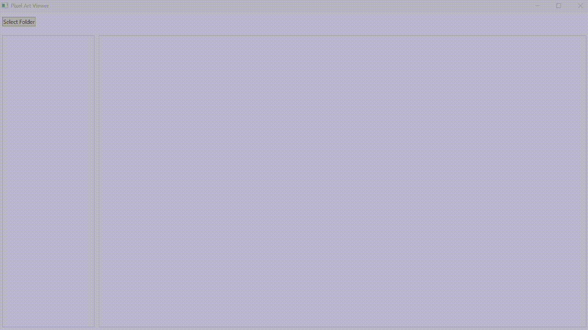

# Pixel Art Viewer

## Overview

Pixel Art Viewer is a lightweight Windows application designed to browse and view pixel art images across various folder structures. Perfect for game developers, pixel art enthusiasts, and digital artists who need a simple, efficient image viewer.

## Features

- 🖼️ Browse images across entire folder structures
- 🔍 Supports multiple image formats:
  - PNG
  - JPG/JPEG
  - BMP
  - WebP
- 📏 Image dimension and file size display
- 🖥️ Pixel-perfect rendering with nearest-neighbor scaling
- 📂 Recursive folder searching

## How to Use

1. Clone the repository
2. Run `PixelArtViewer.exe`
3. Click "Select Folder" to browse your pixel art image directories

## System Requirements

- Windows 10 or later
- [Requires .NET Desktop Runtime 8.0 if not already installed](https://dotnet.microsoft.com/download/dotnet/8.0)

## Notes

- Supports image formats: PNG, JPG, JPEG, GIF, BMP, WebP
- Displays image dimensions and file size
- Recursive folder searching enabled